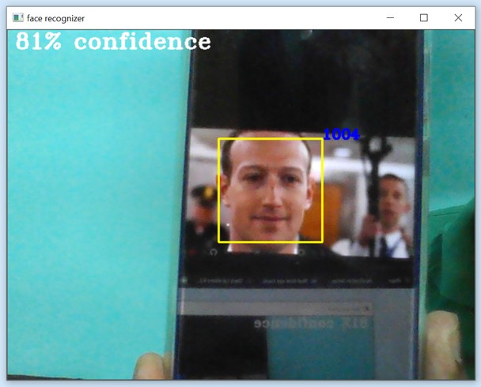

# Student-Attendance-OpenCV

# ABSTRACT

Following the project, the purpose of this report is to analyze the advantages and disadvantages, problems encountered and solutions found when using face detection and recognition in an academic environment to keep track of the attendance of students. 
A small introduction will outline the content of the report and it will continue with the advantages and disadvantages of the face detection and recognition system compared to the other biometrics authentication methods. Subsequently, a detailed description of the two main parts of the project and how they work will follow, as well as problems encountered during the project and how they were solved. Even though it is difficult to build a flawless system, solutions were found for the most impactful issues and workarounds were found for the problems caused by the limitations of the software used. 

# CONTENTS
1. Introduction
2. Proposed Plan
3. Concepts Used
4.	DFD and ER Diagram
5.	Coding
6.	GUI and Execution
7.	SWOT Analysis
8.	Application
9.	Conclusion
10.	Reference

# 1. Introduction

### Purpose
The purpose of this report is to follow up on a project on face detection and recognition and give insight into how feasible it is to use a face recognition attendance system in a university environment. 
### Scope
The system should be built to be used for a prolonged period of time, anywhere on the university campus where attendance would be tracked. 
### Method 
Building such a system from scratch using the Python programming language helped achieve a  better understanding of the field as well as its advantages and disadvantages compared to other biometric authentication methods. After some research, the decision to do face detection using an OpenCV library for Python and face recognition using Microsoft’s Face API was unavoidable due to not having a system that could reliably do both detection and recognition in the project’s circumstances.  

# 2. Proposed plan

* We propose a system that by automating the process of attendance management that can be used during a lecture which will save effort and time.
* The system captures the image of the Students in the collectCapture module.
* Sends it to the faceExtractor module for preprocessing of the images.
* Then we train the images in the train_model module and save the model.
* Use the trained model to take attendance of students.

# 3. Concepts Used

### Face Detection In OpenCV  
Python programming language consists of an open-source library named OpenCV. It contains a module named **cascadeClassifier()**. This library was used for having face detection work in real-time on a webcam feed. We pass the ***“haarcascade_frontalface_default.xml”*** file as an argument into that OpenCV module.
### Face Recognition
For Face recognition, we use the **Local Binary Pattern Histograms(LBPH) Algorithm** to train our model. LBPH is a powerful feature that was first described in 1996. LBP is combined with histograms to represent the face images as simple data vectors. It is easy, accessible, and robust. In our project, we use the OpenCV predefined module i.e. ***LBPHFaceRecognizer_create()*** to create the recognizer and use this to train our model which can recognize faces to predict the Regd. No. 

# 4.	DFD and ER Diagram

### Data Flow Diagram

### ER Diagram

# 5.	Coding
In the backend of our project supervised Machine Learning model is used. The description of the modules are as follows:

### Data Collection
#### dataCollection.py  
➔	collectCapture(Id, Name) 
◆	Capture Images 
◆	Resize and convert to the grayscale image 
◆	Send image to faceExtractor(Img) 
◆	Store processed image in “img_data’ folder 
◆	Create a CSV file for attendance 
➔	faceExtractor(img) 
◆	Identify the region of the face 
◆	Crop the face from the image 

### Training of Model
#### modelTraining.py 
➔	train_model() 
◆	Load each image from ‘img_data’ one by one 
◆	Convert image to NumPy array & store in trainingData 
◆	Split the regd no from image name & store in labels. 
◆	Create recognizer using 
◆	recognizer = cv2.face.LBPHFaceRecognizer_create() 
◆	Train the model using : recognizer.train() 
◆	Save the model in ‘model.xml’ 

### Model Testing
#### testingModel.py
➔	take_attendance() 
◆	Create faceClassifier and load the model (‘model.xml’) 
◆	Capture image & extract face. 
◆	Pass the image to the model prediction 
◆	Identify the Regd no 
◆	Display video with Regd no & confidence of the prediction 
◆	Update student attendance sheet. 

The complete code will be enclosed in a link in conclusion. 

# 6. GUI Design and Execution

# 7. SWOT Analysis

The following SWOT Analysis outlines the advantages and disadvantages of facial detection and recognition systems can bring. 

|<h2>STRENGTHS</h2>|<h2>WEAKNESS</h2>|
|------------------|-----------------|
|<li>It can be faster than other biometrics authentication methods.</li><li>There are a lot of APIs and SDKs online that help builds such a system</li><li>It is easy to detect intruders.</li><li>Footage can be recorded to be manually checked.</li><li>It can detect emotions and other facial details such as eye and hair color.</li>|<li>It is not as accurate as other biometrics authentication methods.</li><li>It depends on the distance and poses of the face as well as the quality, illumination of the image/video used.</li><li>Accessories such as glasses or hats can negatively impact the accuracy of the system.</li><li>It is slow if it does not use live video footage for recognition.</li>|

|<h2>OPPORTUNITIES</h2>|<h2>THREATS</h2>|
|----------------------|----------------|
|<li>It can speed up the process of checking attendance at school/work.</li><li>Face recognition systems are becoming more reliable and accurate</li><li>Such systems are easy to implement due to how advanced technology is.</li><li>It offers protection against intruders as they can be easily detected.</li>|<li>Other biometrics authentication attendance at school/work.</li><li>Intruders can abuse the system by wearing accessories to hide their identity.</li><li>It has to use live video footage for recognition to be faster than other systems.</li>|

# 8. Other Applications

Other applicative usages for Face Detection and Recognition include:
* Industrial Usage: Employee Attendance Automation
* Criminal Identification: Detection of an unknown person
* IoT applications: Automate home security

# 9. Conclusion

Face detection and recognition systems would certainly speed up the process of checking student attendance in comparison to other biometrics authentication methods and in the right circumstances, it would be able to match their accuracy. We used harr cascade XML file and LBPH Algorithm in OpenCV to get a confidence of 85%.

Our entire project is uploaded on GitHub which can be viewed in the following link: https://github.com/Biswajit-Panda/Student-Attendance-OpenCV

# 10. Reference

https://docs.opencv.org/3.4/db/d28/tutorial_cascade_classifier.html

https://docs.opencv.org/2.4/modules/contrib/doc/facerec/facerec_tutorial.html#local-binary-patterns-histograms

